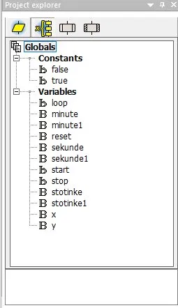
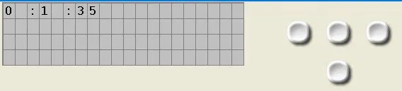
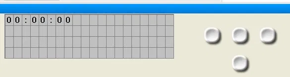
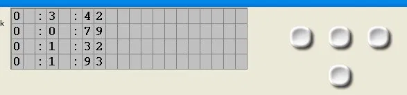

[README (2).md](https://github.com/user-attachments/files/28058610/README.2.md)
# ⏱️ Digitalna Štoperica — PIC16F88 & Flowcode

> Laboratorijska vježba iz predmeta **Praktična nastava**  
> Mentor: **Prof. Alen Nuhić** | Učenici: **Tarik Redžić, Ahmed Mrakanović, Dino Poljić**  
> Tuzla, maj/svibanj 2026.

---

## 📋 Pregled projekta

Digitalna štoperica realizovana na mikrokontroleru **PIC16F88** uz korištenje grafičkog razvojnog okruženja **Flowcode**. Projekat demonstrira primjenu Timer prekida (Interrupts) za precizno mjerenje vremena, upravljanje LCD ekranom te implementaciju korisničkog interfejsa putem fizičkih tastera.

---

## ✨ Funkcionalnosti

| Funkcija | Opis |
|---|---|
| ▶️ **Start / Stop** | Pokretanje i zaustavljanje mjerenja vremena |
| 🔁 **Reset** | Vraćanje štoperice na nulu |
| 🏁 **Lap** | Privremeno zamrzavanje prikaza dok tajmer nastavlja raditi u pozadini |
| 📟 **LCD prikaz** | Prikaz u formatu `MM:SS.d` (minute : sekunde . desetinke) |
| ⚡ **Preciznost** | Rezolucija mjerenja: **0.1 sekunda (100 ms)** |

---

## 🔧 Hardverske specifikacije

- **Mikrokontroler:** PIC16F88 (Microchip RISC familija)
- **Oscilator:** Interni, do 8 MHz
- **Napon napajanja:** 5V DC (stabilisan)
- **Display:** LCD 16×2 (HD44780 kontroler), 4-bitna komunikacija, port B
- **Tasteri:** 3× digitalni taster na portu A, pull-down konfiguracija
- **Tajmer moduli:** 3 nezavisna modula; Timer Interrupt za precizno mjerenje

---

## 💻 Softverska arhitektura

```
INICIJALIZACIJA
    │
    ├── Konfiguracija internog oscilatora
    ├── Port A → INPUT  (tasteri)
    ├── Port B → OUTPUT (LCD)
    └── Timer Interrupt konfiguracija
           │
           ▼
    GLAVNA PETLJA
    │
    ├── Detekcija pritiska tastera (Start/Stop/Lap/Reset)
    ├── Logika upravljanja stanjem štoperice
    └── Formatiranje i ispis na LCD (MM:SS.d)
           │
    [TIMER ISR] ← aktivira se svakih 100ms
    │
    └── Inkrement vremenskih varijabli (desetinke → sekunde → minute)
```

---

## 📸 Screenshotovi projekta

### 🗂️ Globalne varijable (Project Explorer)

> Prikaz svih globalnih varijabli korištenih u projektu. Definirane su varijable za upravljanje stanjem štoperice: `start`, `stop`, `reset`, `loop`, te zasebne varijable za `minute`, `sekunde` i `stotinke` — svaka u duplikatu (`minute1`, `sekunde1`, `stotinke1`) radi implementacije **Lap funkcije**. Varijable `x` i `y` koriste se kao pomoćne u logici prikaza.

---

### 🔀 Flowcode dijagram toka (glavni program)
.webp)
> Kompletan grafički program izrađen u Flowcode okruženju. Jasno su vidljive sve programske strukture: inicijalizacija sistema, glavna petlja s uvjetnim grananjima za detekciju tastera, Timer Interrupt rutina za precizno mjerenje te algoritam formatiranja i ispisa vrijednosti na LCD ekran.

---

### ▶️ Simulacija — štoperica u radu

> Prikaz simulacije dok je štoperica aktivna. LCD ekran prikazuje izmjereno vrijeme u formatu `M : SS : ds` (minuta : sekunde : desetinke). Na screenshotu se vidi vrijednost `0 : 1 : 35`, što potvrđuje ispravan rad tajmera i tačnost mjerenja.

---

### 🔄 Simulacija — početno stanje (reset)

> Početno stanje štoperice nakon pokretanja ili resetovanja. Ekran prikazuje `00 : 00 : 00`, što potvrđuje da su sve varijable pravilno inicijalizirane na nulu i da je sistem spreman za novo mjerenje.

---

### 🏁 Simulacija — Lap funkcija (prolazna vremena)

> Demonstracija **Lap funkcije** — na LCD-u su prikazana četiri uzastopna prolazna vremena:
> - `0 : 3 : 42`
> - `0 : 0 : 79`
> - `0 : 1 : 32`
> - `0 : 1 : 93`
>
> Dok je prikaz zamrznut za svako prolazno vrijeme, tajmer u pozadini nastavlja neometano raditi, što je ključna karakteristika profesionalnih štoperica.

---

## 📁 Struktura repozitorija

```
📦 stoperica-flowcode
 ┣ 📁 slike/
 ┃  ┣ 🖼️ project_explorer.png     ← Globalne varijable
 ┃  ┣ 🖼️ flowcode_dijagram.png    ← Dijagram toka programa
 ┃  ┣ 🖼️ simulacija_rad.png       ← Štoperica u radu
 ┃  ┣ 🖼️ simulacija_reset.png     ← Početno stanje
 ┃  └ 🖼️ simulacija_lap.png       ← Lap funkcija
 ┣ 📄 stop start.fcf                                         ← Flowcode projekat
 ┣ 📄 Izvjestaj - Tarik Redzic, Ahmed Mrakanovic, Dino Poljic.docx  ← Tehnički izvještaj
 ┗ 📄 README.md                                              ← Ovaj fajl
```

---

## 🚀 Pokretanje projekta

### Preduslovi
- [Flowcode](https://www.matrixtsl.com/flowcode/) (verzija kompatibilna sa `.fcf` formatom)
- Simulator uključen u Flowcode ili fizički PIC16F88 programator

### Koraci
1. Kloniraj repozitorij:
   ```bash
   git clone https://github.com/USERNAME/NAZIV-REPOZITORIJA.git
   ```
2. Otvori `stop start.fcf` u **Flowcode** okruženju
3. Pokreni simulaciju klikom na **Simulate** ili kompajliraj za fizički mikrokontroler

---

## 📊 Algoritam — dijagram toka

```
        [START]
           │
    [Inicijalizacija]
           │
    ┌──────▼──────┐
    │  Pritisnut  │──── START ────► Pokreni tajmer
    │   taster?   │──── STOP  ────► Zaustavi tajmer
    └──────┬──────┘──── RESET ────► Resetuj varijable
           │           LAP   ────► Zamrzni LCD prikaz
           │
    [Timer Interrupt]
           │
    [Inkrement desetinki]
           │
    [Formatiranje MM:SS.d]
           │
    [Ispis na LCD]
           │
    └────► [Povratak u petlju]
```

---

## 🎓 Obrazovni kontekst

Projekat je izrađen u sklopu laboratorijske vježbe i pokriva sljedeće koncepte:

- Primjena **Timer/Counter prekida** u embedded sistemima
- Konfiguracija i upravljanje **LCD ekranom** putem mikrokontrolera
- Implementacija **debouncing** mehanizma za tastere (softverski)
- Grafičko programiranje pomoću **Flowcode** dijagrama toka
- Osnove arhitekture **PIC mikrokontrolera** (RISC, memorija, I/O portovi)

---

## 👥 Autori

| Ime i prezime | Uloga |
|---|---|
| Tarik Redžić | Razvoj i implementacija |
| Ahmed Mrakanović | Razvoj i implementacija |
| Dino Poljić | Razvoj i implementacija |

**Mentor:** Prof. Alen Nuhić

---

## 📄 Licenca

Ovaj projekat je izrađen u edukacijske svrhe u okviru nastavnog programa.

---

<p align="center">
  <i>Izrađeno u Flowcode okruženju · PIC16F88 · Tuzla, 2026.</i>
</p>
